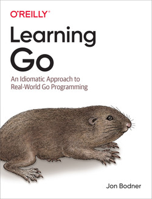

# Go Programming Language Note
Hello World! This is me `Sakib Dalal`. I'm currently studying Go Programming Language, hope this repo will help you to get started as a Go developer. 
***
The book I'm referring to create this notes is LEARNING GO by Jon Bodner, O'REILLY publication.

***
